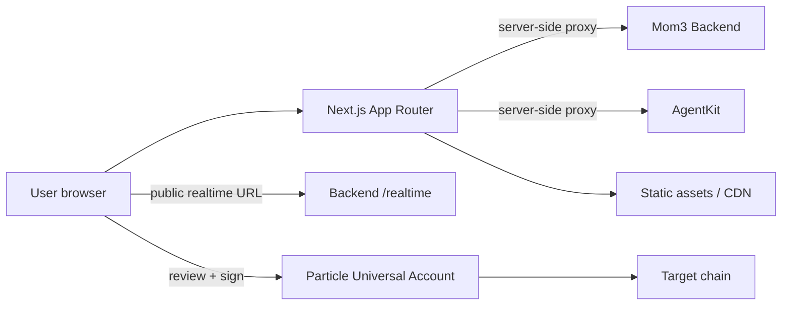
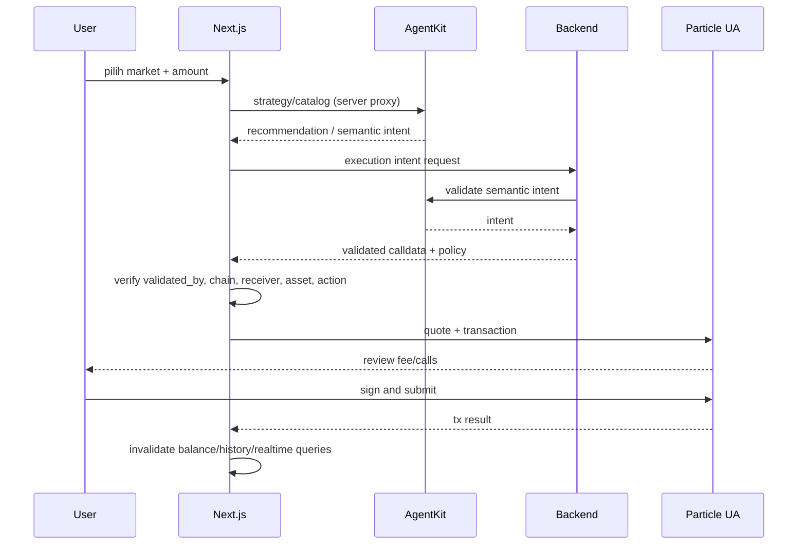

# Frontend Production Readiness

Mom3 Frontend adalah Next.js App Router BFF dan client wallet. Route handler
server-side meneruskan request ke Backend/AgentKit; browser mengelola UI,
wallet session, Particle quote, user review, dan signature. Browser tidak boleh
memanggil service internal dengan secret.

## Arsitektur produksi



## Runtime contract

| Item | Production rule |
| --- | --- |
| Runtime | Node.js 20 LTS, Next.js production build |
| Build | `pnpm.cmd install --frozen-lockfile` lalu `pnpm.cmd build` |
| Start | `pnpm.cmd start` pada port deployment |
| Browser API | Gunakan `/api/*` route handler bila request memerlukan server env |
| Realtime | `NEXT_PUBLIC_MOM3_REALTIME_URL` atau backend `/realtime` fallback |
| Wallet | Signing hanya setelah intent, chain, receiver, asset, dan amount diverifikasi |

## Data-flow dan safety gate



Tidak ada UI state yang boleh menganggap intent sebagai transaksi sukses.
Status sukses hanya setelah Particle mengembalikan hasil submit/receipt sesuai
flow yang dipakai aplikasi.

## Environment dan secret policy

- `NEXT_PUBLIC_*` selalu dianggap dapat dilihat browser: hanya public project
  identifiers, RPC fallback, dan public URLs yang boleh ada di sana.
- `MOM3_BACKEND_URL`, `MOM3_AGENTKIT_URL`, dan `AAVESCAN_API_KEY` server-only.
- `.env` tidak boleh di-commit. Preview/staging/production harus memiliki
  environment terpisah dan URL yang eksplisit.
- `NEXT_PUBLIC_PARTICLE_REQUIRE_GAS_SPONSORSHIP=true` hanya bila quote gasless
  aktif telah diverifikasi pada execution path environment tersebut.

## Deploy checklist

1. Install Node 20 dan pnpm yang kompatibel.
2. Inject environment sesuai target deployment; cek tidak ada secret di public env.
3. `pnpm.cmd install --frozen-lockfile`.
4. `pnpm.cmd exec tsc --noEmit --pretty false`.
5. `pnpm.cmd build`.
6. Jalankan smoke test halaman utama, login, market catalog, detail, send,
   claim username, dan history pada staging.
7. Verifikasi route `/api/ai/markets`, `/api/ai/execution-markets`, dan
   `/api/ai/execution-intent` meneruskan status/error dengan benar.
8. Verifikasi WebSocket connect, subscribe, reconnect, dan query invalidation.
9. Verifikasi production source map/log tidak membocorkan secret.

## Operational checks

```powershell
$base = 'https://app.example.com'
Invoke-WebRequest "$base/" -UseBasicParsing
Invoke-RestMethod "$base/api/ai/markets?chainId=42161&executionOnly=true"
```

Check browser network harus menunjukkan request internal sensitif hanya melalui
server route handler. Pastikan public realtime URL dapat diakses browser dan
backend CORS mengizinkan origin production.

## Failure modes dan observability

| Signal | Arti | Tindakan |
| --- | --- | --- |
| route `502` | Backend/AgentKit upstream gagal | tampilkan retry/degraded state; cek upstream health |
| route `503` | capability belum configured | jangan menampilkan CTA execute yang tidak valid |
| market kosong | catalog unavailable/stale | tampilkan empty state yang jujur dan retry |
| WebSocket reconnect loop | URL/CORS/proxy issue | cek `NEXT_PUBLIC_MOM3_REALTIME_URL` dan upgrade headers |
| quote gasless tidak ada | sponsorship tidak tersedia | gunakan normal quote atau block sesuai policy |
| transaction rejected | user/chain/provider rejection | tampilkan alasan, jangan klaim sukses |

Monitor server response rate/latency, client error rate, WebSocket reconnect,
quote failure, transaction rejection, dan web vitals. Correlation ID dari BFF
sebaiknya diteruskan ke backend/AgentKit tanpa memasukkan credential.

## Release, rollback, dan security acceptance

Gunakan immutable deployment per commit SHA. Rollback ke build terakhir yang
sehat bila smoke test atau error budget gagal; environment rollback harus
memastikan URL upstream tetap kompatibel.

- [ ] Typecheck dan production build lulus.
- [ ] Tidak ada secret dalam bundle atau `NEXT_PUBLIC_*`.
- [ ] Semua CTA execute melewati backend-validated intent.
- [ ] Chain, receiver, asset, decimals, action, dan amount diverifikasi sebelum sign.
- [ ] Auth/session expiry, empty, loading, error, rejected, dan reconnect state diuji.
- [ ] CSP, security headers, HTTPS, CORS, dan rate limit gateway aktif.
- [ ] Accessibility keyboard/focus dan mobile layout diverifikasi pada flow utama.
